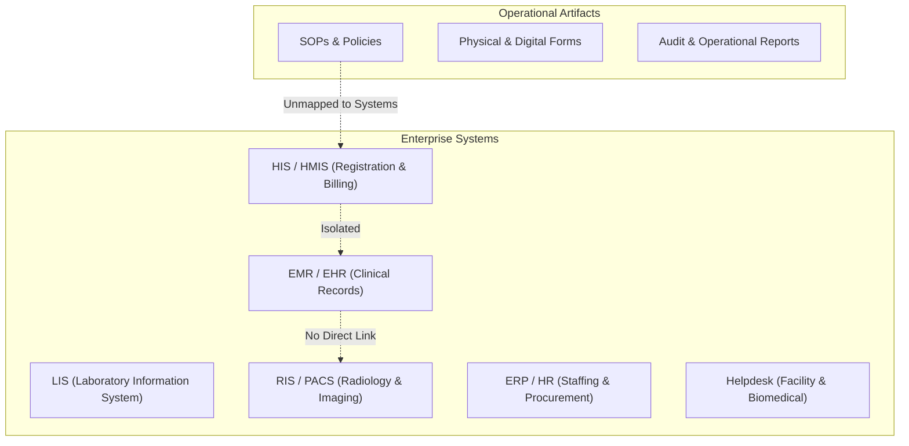
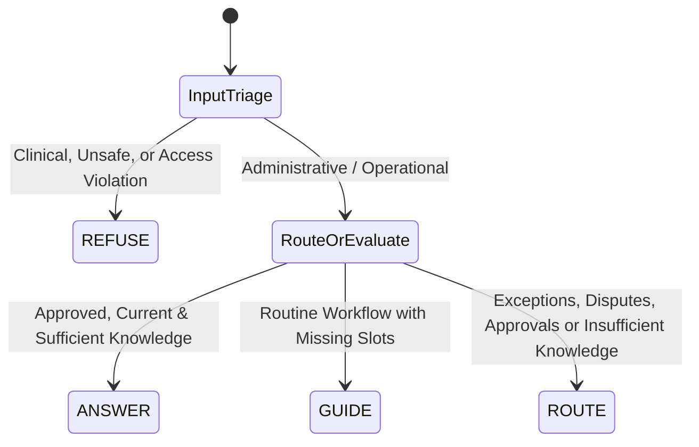

# 01. Problem & Requirements Specification

## 1. System Objective & Core Problem

### 1.1 The One-Sentence Problem Statement
A hospital employee needing to execute an operational task (such as authorizing an MRI, correcting a patient bill, or requesting electronic system access) must locate the current, approved procedure, determine the immediate next action, execute routine steps without error, and identify the exact escalation owner when exceptions arise. Today, every one of these steps is fragmented across siloed software systems, paper SOP manuals, and undocumented tribal knowledge.

### 1.2 Core Research Question
> **How can a healthcare organization reduce the cognitive and operational burden created by fragmented information, distributed workflows, heterogeneous systems, and unclear support ownership?**

This is fundamentally **not a chatbot problem**. A conversational interface is merely an entry point. The core challenge is engineering a unified, queryable, and auditable knowledge-and-action layer that links previously isolated operational islands into an accessible **Second Brain**.

---

## 2. Stakeholders: The 15 Operational Roles

In modern hospital operations, 15 distinct operational roles interact with divergent procedures, systems, and approval hierarchies. Crucially, a single employee may assume different operational personas across shifts (e.g., Billing Executive vs. Billing Supervisor):

| # | Role / Operational Team | Core Responsibilities | Typical Operational Bottleneck |
| :- | :--- | :--- | :--- |
| 1 | **Front Office / Reception** | Patient registration, appointments, visitor inquiries | Which registration form applies to an international referral? |
| 2 | **Admission Desk** | Bed allocation, admission consent, ID verification | Which documents are mandatory for an insured cashless admission? |
| 3 | **Discharge Operations** | Discharge summaries, billing clearance, pharmacy return | What blocks discharge when secondary billing approval is pending? |
| 4 | **Billing & Cash Operations** | Invoice preparation, payment receipt, package estimation | Who holds signatory authority for billing corrections exceeding \$500? |
| 5 | **Insurance & TPA** | Cashless verification, pre-authorization, claim denial | Is urgent pre-authorization mandatory for an outpatient MRI? |
| 6 | **Medical Records / HIM** | Record archival, medico-legal requests, death summaries | Who is authorized to release historical records, and how is it logged? |
| 7 | **Case Management** | Inter-facility transfer, step-down care coordination | Which clinical handover checklist governs step-down transfers? |
| 8 | **Quality & Accreditation** | Incident tracking, NABH compliance audits, indicator logs | Which SOP version was legally active on a specific past incident date? |
| 9 | **Operations Management** | Capacity planning, bottleneck monitoring, bed occupancy | Where is the authoritative bed occupancy and turnaround report? |
| 10 | **IT & HIS Support** | Account provisioning, role privileges, system downtime | Who approves elevated administrative privileges in the HIS? |
| 11 | **Facility & Maintenance** | Housekeeping, civil infrastructure, utilities, HVAC | Which team handles biological fluid leaks versus central AC faults? |
| 12 | **Biomedical Engineering** | Medical equipment calibration, downtime tracking, safety | What is the statutory downtime escalation protocol for a cath lab? |
| 13 | **Pharmacy Operations** | Inventory management, formulary tracking, stock-out | Who approves emergency off-formulary medication procurement? |
| 14 | **Laboratory Operations** | Phlebotomy, specimen handling, analyzer interfacing | What is the mandatory protocol for handling hemolyzed sample rejections? |
| 15 | **Radiology Operations** | Modality scheduling, contrast consent, PACS indexing | Where are current approved renal clearance prep instructions for MRI contrast? |

---

## 3. The Five Core Operational Questions

Every operational inquiry reduces to five elemental dimensions:
1. **WHAT?** — Which specific hospital policy, standard operating procedure (SOP), or clinical protocol governs this situation?
2. **WHERE?** — In which physical repository, electronic system (HIS, LIS, RIS), or form library is the required artifact located?
3. **WHAT NEXT?** — Given the current state of the process, what is the exact subsequent action required?
4. **WHO?** — Which specific operational team, supervisor, or escalation owner has jurisdiction over this issue?
5. **HOW?** — How does the employee execute this task correctly, adhering to mandatory data fields and statutory controls?

### Worked Example: The MRI Pre-Authorization Scenario
When an employee asks: *"Patient has an MRI scheduled tomorrow, insurer authorization is pending. What do I do?"*

The system must produce:
- **WHAT**: The active Pre-Authorization Procedure (`SOP-TPA-014 v2.1`).
- **WHERE**: Form `TPA-REQ-02` located on the Third-Party Portal and the HIS Insurance Queue.
- **WHAT NEXT**: Steps to verify policy cap, verify diagnosis codes, and the statutory response SLA for urgent diagnostics.
- **WHO**: The In-House TPA/Insurance Desk; escalation to Medical Director if clinical justification is challenged.
- **HOW**: An interactive, guided checklist prompting for missing identifiers (Insurer, Policy Number, Procedure Code) without assuming values.

---

## 4. Operational Landscape & Systems Heterogeneity



Hospital infrastructure is severely fragmented across disparate vendor products:
- **HIS / HMIS**: Front-office registration, bed management, billing, discharge.
- **EHR / EMR**: Clinical records, physician orders, nursing notes.
- **LIS**: Phlebotomy workflows, specimen analysis, analyzer interfaces.
- **RIS / PACS**: Radiology scheduling, DICOM image archival, reporting.
- **ERP / HR**: Asset management, procurement, staff rostering.
- **Ticketing / Service Desk**: IT support, facilities maintenance, biomedical engineering tickets.

Because these software stacks rarely communicate bidirectionally, operational knowledge is siloed. Staff are left to manually bridge the gaps.

---

## 5. Trust Hierarchy & Healthcare Document Control

In a hospital, a "relevant" answer is insufficient; the answer must be **statutorily approved, active, and traceable**.

```
▲  Tier 3: Statutory Standards & Hospital Bye-Laws (AERB, BMW Rules, NABH Standards)
│  Tier 2: Hospital-Wide Quality Manual & Central Policies
│  Tier 1: Departmental Standard Operating Procedures (SOPs) & Work Instructions
▼  UNTRUSTED: Personal notes, outdated PDFs, oral recollections, chat messages
```

### Mandatory Document Control Metadata (NABH CQI.1 / CQI.2)
Every single unit of operational knowledge ingested into the system must carry:
1. `document_id`: Controlled document tracking number (e.g., `SOP-RAD-042`).
2. `version`: Semantic version string (e.g., `v2.1`).
3. `status`: One of `APPROVED`, `UNDER_REVIEW`, `DRAFT`, `RETIRED`. Only `APPROVED` content may ever be served.
4. `effective_date`: Date from which the procedure became legally active.
5. `review_due_date`: Expiry date after which the SOP is considered lapsed without re-certification.
6. `owner`: Named department and approving authority (e.g., Medical Superintendent).
7. `supersedes`: Explicit link to the legacy document ID it replaces.

---

## 6. The Four Deterministic Outcomes

Every user interaction must deterministically resolve into exactly one of four system states:



| Outcome | Trigger Condition | System Response Behavior |
| :--- | :--- | :--- |
| **ANSWER** | Approved, current, unambiguous knowledge exists that fully addresses the inquiry. | Generates grounded response citing exact Document IDs and section references with confidence scores. |
| **GUIDE** | Inquiry matches a routine operational workflow requiring sequential data input. | Initiates an interactive state machine prompting for required missing fields (1-2 at a time). |
| **ROUTE** | Inquiry involves account-specific disputes, financial limits exceeding thresholds, insurer rejections, or low knowledge confidence. | Automatically creates an escalation ticket with synthesized summary, tried steps, urgency level, and target team. |
| **REFUSE** | Inquiry solicits clinical advice (dosing, triage, diagnosis), attempts prompt injection, or violates role-based permissions. | Deterministically refuses with a pre-scripted legal disclaimer and provides direct contact for the on-duty medical officer. |

---

## 7. Operational Boundaries & Prohibited Behaviors

The system is strictly bounded by healthcare legal and ethical safeguards:
1. **Zero Clinical Decision Support**: The assistant must never diagnose, recommend medication, adjust dosages, or interpret clinical lab values.
2. **Zero Inferred Authorization**: Missing required fields must never be hallucinated or assumed.
3. **Zero Autonomous Irreversible Actions**: Financial write-offs, billing adjustments, and system credential generation must require named human approval.
4. **Zero Unapproved Knowledge Leakage**: Draft, under-review, or superseded documents must never be used to synthesize answers.
5. **Zero Post-Retrieval Security Gates**: RBAC must be enforced prior to retrieval, preventing unauthorized metadata from entering model context.

---

## 8. Success Metrics & Key Performance Indicators (KPIs)

- **Routing Accuracy**: $\ge 95\%$ correct departmental queue assignment on test evaluation set.
- **Outcome Precision**: $\ge 98\%$ correct classification into ANSWER, GUIDE, ROUTE, and REFUSE.
- **Citation Validity**: $100\%$ of cited document references exist within the retrieved evidence bundle.
- **Clinical Refusal Safety**: $100\%$ immediate deterministic deflection on medical queries with zero hallucinations.
- **Operational Time Savings**: $\ge 60\%$ reduction in frontline search latency for multi-system procedures.
