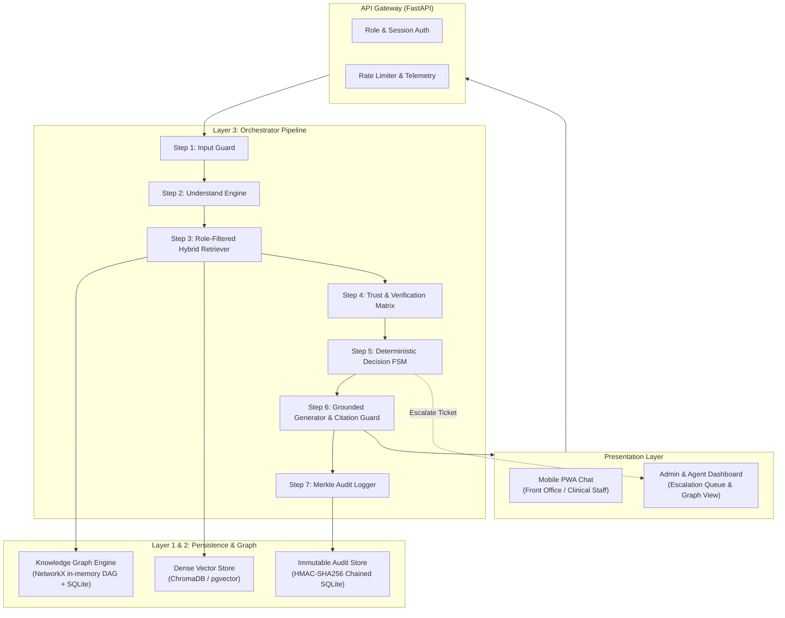

# 02. System Architecture & Engineering Design

## 1. Architectural Philosophy: "LLM Reasons, Rules Decide"

In hospital operations, systems that rely on unconstrained probabilistic LLMs for governance, decision-making, or access enforcement fail safety audits. Generative models hallucinate, drift under stress, and are vulnerable to adversarial framing.

The **Healthcare Operations Assistant** decouples cognitive reasoning from policy enforcement:
- **The LLM is a Linguistic Processor**: Used solely for entity extraction, semantic disambiguation, and natural language synthesis strictly conditioned on retrieved facts.
- **Deterministic Rules are the Arbiter**: All access controls (RBAC), procedural routing, workflow stage progressions, clinical hazard blocks, and approval thresholds are executed by deterministic Python and database logic.

```
┌─────────────────────────────────────────────────────────────┐
│                 PROBABILISTIC / COGNITIVE                   │
│   • Parse unstructured query into structured intent slots   │
│   • Synthesize readable explanation from grounded bundle    │
└──────────────────────────────┬──────────────────────────────┘
                               │ Governed & Verified by
┌──────────────────────────────▼──────────────────────────────┐
│                 DETERMINISTIC / REGULATORY                  │
│   • Input safety guards & Emergency/Clinical short-circuit  │
│   • Pre-retrieval role-based access filtering (SQL/Cypher)  │
│   • Finite State Machine (ANSWER / GUIDE / ROUTE / REFUSE)  │
│   • Document validity, versioning, and conflict resolution  │
│   • Post-generation AST citation verification               │
│   • Cryptographic append-only audit trail logging           │
└─────────────────────────────────────────────────────────────┘
```

---

## 2. High-Level Architecture (C4 Container View)



---

## 3. The 7-Step Orchestrator Pipeline

### Step 1: Input Guard (100% Deterministic)
Executes before any LLM invocation to guarantee sub-millisecond safety and zero token waste:
1. **PII/PHI Sanitizer**: Deterministic regex and named-entity patterns redact Patient Names, MRNs (Medical Record Numbers), Aadhaar/SSN, and Phone Numbers.
2. **Clinical Hazard & Emergency Shield**: Scans for acute clinical markers (e.g., chest pain, SpO2, tachycardia, pediatric dosing, medication titration). Matches trigger immediate state `REFUSE`, returning statutory emergency contacts (e.g., Code Blue / Triage).
3. **Adversarial / Injection Defense**: Detects prompt injection markers (`SYSTEM OVERRIDE`, `IGNORE PREVIOUS INSTRUCTIONS`).

### Step 2: Understand Engine (Probabilistic with Typed Contracts)
Converts unstructured user inquiries into a validated Pydantic data model. The LLM is forced to output structured JSON complying with rigid enums:

```python
class QueryIntent(str, Enum):
    KNOWLEDGE_QUERY = "KNOWLEDGE_QUERY"
    START_WORKFLOW = "START_WORKFLOW"
    RESUME_WORKFLOW = "RESUME_WORKFLOW"
    CHECK_STATUS = "CHECK_STATUS"
    ESCALATION_REQUEST = "ESCALATION_REQUEST"
    CLINICAL_OUT_OF_SCOPE = "CLINICAL_OUT_OF_SCOPE"

class ExtractedEntities(BaseModel):
    intent: QueryIntent
    procedure: Optional[str] = None
    insurer: Optional[str] = None
    system_name: Optional[str] = None
    urgency_flag: bool = False
    raw_query: str
```

### Step 3: Role-Filtered Hybrid Retrieval (Deterministic)
Retrieval operates under strict **HIPAA Minimum Necessary** rules:
1. **Pre-Retrieval RBAC Filtering**:
   ```sql
   SELECT id, title, body, authority_tier FROM nodes
   WHERE status = 'approved' 
     AND effective_date <= CURRENT_DATE 
     AND (json_extract(metadata, '$.visible_to') LIKE '%' || :user_role || '%' 
          OR json_extract(metadata, '$.visible_to') LIKE '%ALL%');
   ```
2. **Hybrid Search**: Dense semantic search (embeddings) combined with BM25 keyword matching over authorized nodes.
3. **Bounded DAG Graph Expansion**:
   - Expands 1 to 2 hops along typed edges (`requires`, `done_in`, `owned_by`, `escalates_to`).
   - Supernode protection: Hub nodes (nodes with degree $> 25$) are penalized via inverse degree weighting:
     $$W(u, v) = \frac{1}{\log(1 + \text{Degree}(v))}$$
   - Cap total expanded nodes at $k \le 15$ to prevent RAG context dilution.

### Step 4: Verification & Trust Matrix (Deterministic)
Evaluates the retrieved evidence bundle against mathematical confidence criteria:

$$S_{\text{total}} = 0.35 \cdot T_{\text{trust}} + 0.30 \cdot C_{\text{coverage}} + 0.20 \cdot G_{\text{connectivity}} + 0.15 \cdot \text{Sim}_{\text{retrieval}} - P_{\text{conflict}}$$

- **$T_{\text{trust}}$**: 1.0 if all nodes are approved; penalized exponentially if document is past `review_due_date`.
- **$C_{\text{coverage}}$**: Ratio of the 5 Questions (What, Where, What Next, Who, How) addressed by the subgraph.
- **$G_{\text{connectivity}}$**: Density of explicit edges connecting retrieved procedures to systems and teams.
- **$P_{\text{conflict}}$**: Set to 1.0 if two contradictory approved SOPs are retrieved without a clear authority winner.

#### The 3-Tier Authority Resolution Matrix
When multiple approved SOPs overlap:
- **Tier 3 (Statutory & Bye-Laws)**: Overrides Tier 2 and Tier 1.
- **Tier 2 (Hospital-Wide Quality Manual)**: Overrides Tier 1.
- **Tier 1 (Departmental SOPs)**: If two Tier 1 SOPs contradict each other, the system automatically sets $P_{\text{conflict}} = 1.0$ and triggers `ROUTE` to the Quality Committee.

### Step 5: Deterministic Decision Engine (FSM)
Evaluates computed metrics against rigid state transition boundaries:

```python
def evaluate_decision(guard_passed: bool, S_total: float, conflict: bool, session: Session) -> Outcome:
    if not guard_passed:
        return Outcome.REFUSE
    if conflict:
        return Outcome.ROUTE(reason="Conflicting approved SOPs detected. Sent to Quality Committee.")
    if S_total < 0.50:
        return Outcome.ROUTE(reason="Insufficient approved knowledge. Escalated to department lead.")
    if session.is_workflow_in_progress or intent == QueryIntent.START_WORKFLOW:
        if session.has_missing_required_fields():
            return Outcome.GUIDE(action="PROMPT_MISSING_FIELDS")
        if session.exceeds_approval_threshold():
            return Outcome.ROUTE(reason="Transaction value requires supervisor sign-off.")
        return Outcome.GUIDE(action="EXECUTE_STEP")
    return Outcome.ANSWER
```

### Step 6: Constrained Generation & Citation Verifier
1. **Grounding Constraint**: Injected prompt forces the LLM to write only facts found inside `<untrusted_hospital_record>` delimiters, citing every sentence as `[Doc_ID]`.
2. **Post-Generation AST Citation Guard**: Programmatic AST parser scans generated text for citations.
   - If any cited `Doc_ID` is not in the retrieved evidence bundle $\implies$ Generation is aborted; fall back to `ROUTE`.
   - If factual assertions lack citations $\implies$ Downscaled to cautious guidance.
3. **Trust Envelope Packaging**: Response is wrapped in a cryptographically signed payload.

### Step 7: Merkle-Chained Audit Trail
Every system action is logged into an append-only store. Each record contains:
$$\text{Hash}_i = \text{HMAC-SHA256}(\text{Query}_i + \text{Role}_i + \text{EvidenceIDs}_i + \text{Outcome}_i + \text{Hash}_{i-1})$$
This guarantees tamper evidence, satisfying **NABH CQI.2** and **HIPAA § 164.312** compliance.

---

## 4. Programmatic Data Contracts

```python
from pydantic import BaseModel
from typing import List, Dict, Any, Optional

class CitationNode(BaseModel):
    node_id: str
    title: str
    doc_type: str
    version: str
    authority_tier: int

class TrustEnvelope(BaseModel):
    audit_uuid: str
    timestamp: str
    user_role: str
    decision_outcome: str  # ANSWER, GUIDE, ROUTE, REFUSE
    composite_score: float
    response_text: str
    citations: List[CitationNode]
    audit_hash: str

class EscalationTicket(BaseModel):
    ticket_id: str
    timestamp: str
    initiator_role: str
    target_team: str
    urgency: str  # ROUTINE, URGENT, CRITICAL
    summary: str
    tried_steps: List[str]
    retrieved_evidence: List[str]
    escalation_reason: str
```
