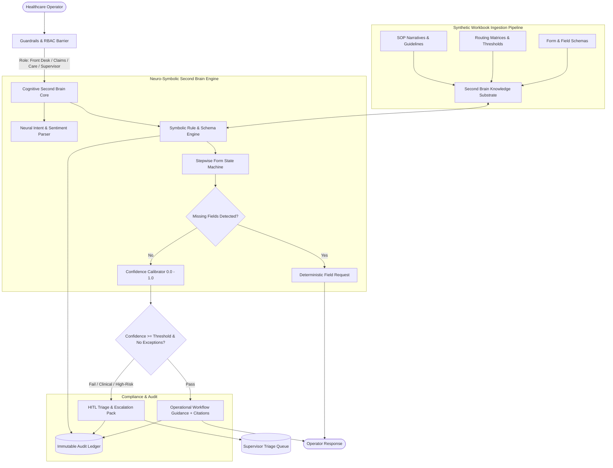

# System Architecture & Technical Specification

## 1. High-Level Architecture Overview

---

## 2. Core Functional Modules

### A. Guardrails & RBAC Filter
* **Clinical Guardrail:** Intercepts clinical/diagnostic inquiries (e.g., symptoms, medication titration, medical necessity judgments) with an immediate fallback to licensed clinical staff.
* **State Mutation Guard:** Administrative operations that alter state (claims adjudication sign-off, financial payment release) cannot execute autonomously; requires authenticated supervisor elevation.
* **Role-Based Access Control:** Validates operator tokens against document classification tags:
  - `FRONT_DESK`: Basic registration, provider directory, standard intake checklists.
  - `CLAIMS_PROCESSOR`: Timely filing rules, CPT/HCPCS modifiers, adjudication matrices.
  - `CARE_MANAGER`: Utilization management thresholds, prior-authorization workflows.
  - `SUPERVISOR`: Exception overrides, escalation context reviews, audit trails.

### B. Synthetic Workbook Ingestion Engine
Ingests two distinct operational data modalities:
1. **Tabular Decision Workbooks:**
   - Routing Matrices (e.g., Service Category $\to$ State $\to$ Prior-Auth Required $\to$ Dollar Cap $\to$ Escalation Trigger).
   - Form Schemas (Required fields, regex patterns, valid options, dependencies).
2. **Unstructured SOP Documents:**
   - Standard Operating Procedures, compliance guidelines, exception manuals.
   - Formatted into addressable chunks down to `doc_id`, `section_id`, and `row_id`.

### C. Stepwise State Machine & Missing Field Evaluator
* For any guided process (e.g., Prior Authorization Intake Form):
  - Ingests partial operator input.
  - Compares against the canonical schema stored in Procedural Memory.
  - Returns missing parameters **deterministically**, prompting one or more fields at a time without hallucination.

### D. Confidence Calibration & Urgency/Sentiment Engine
* **Confidence Calibration ($0.0 - 1.0$):**
  - Synthesizes match score from: exact matrix row match (symbolic weight: 0.6) + semantic relevance (neural weight: 0.4) - missing required parameters penalty.
  - Any score below threshold (e.g., $< 0.80$) triggers Human-in-the-Loop escalation.
* **Urgency & Sentiment:**
  - Evaluates operational urgency: `LOW`, `MEDIUM`, `HIGH`, `CRITICAL` (e.g., time-sensitive discharge, statutory filing deadline).
  - Flags caller/operator sentiment (e.g., distressed patient, adversarial billing query).

### E. Automated Escalation Summary (Context Pack)
When human triage is triggered, the system generates a standardized handoff pack:
- **Ticket ID & Operator Clearance**
- **Trigger Reason:** (e.g., `Confidence Below 0.80`, `Clinical Query Intercepted`, `High-Dollar Prior Auth Exception > $25,000`)
- **Active State & Extracted Parameters**
- **Missing / Unverified Fields**
- **Governing SOP Citations**

### F. Immutable Audit Logging
* Records every interaction as an append-only transaction:
  `{ timestamp, operator_id, role, intent, extracted_data, citations, confidence, action_taken, override_flag }`.
