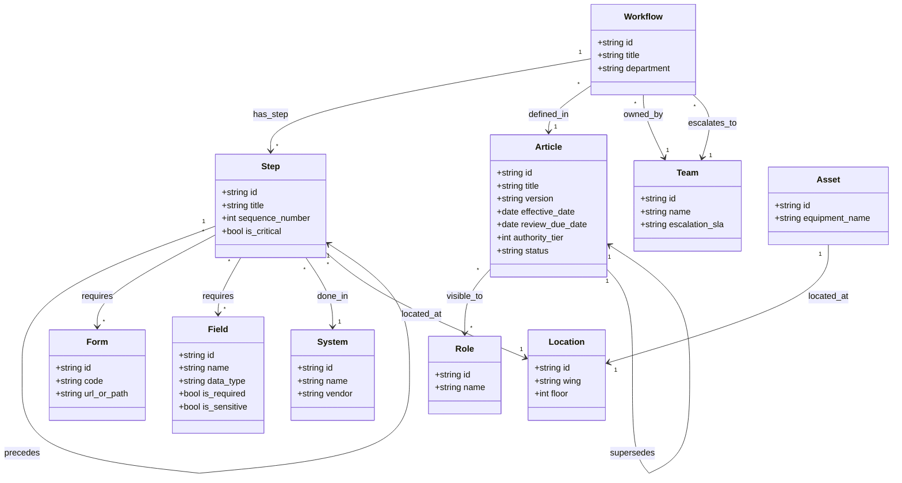

# 03. Knowledge Graph & Ontology Specification

## 1. Why a Knowledge Graph ("Second Brain")?

Naive RAG systems chop unstructured policy documents into arbitrary text chunks and retrieve the top-$k$ nearest chunks via vector similarity. In hospital operations, this approach fails because:
1. **Relationships Carry the Meaning**: Knowing that an MRI requires prior authorization is useless without knowing *which form* to submit, *which system* tracks it, *which team* owns the portal, and *who approves* exceptions. These facts live across different documents, rows, and departments.
2. **Disconnected Documents**: An insurance guideline does not cite the HIS module path. An IT ticketing rule does not mention clinical SOP revisions.
3. **Change Propagation**: When Form `TPA-REQ-02` is revised, a standard vector index cannot determine which 12 hospital workflows are broken by the change.

A **Knowledge Graph** models operational reality as an explicit network of atomic nodes connected by typed, directional relationships.

---

## 2. Formal Ontology Definition



### 2.1 Node Definitions

| Node Type | Operational Meaning | Core Attributes |
| :--- | :--- | :--- |
| `Article` | Approved SOP, Policy, Work Instruction, or Circular | `id`, `title`, `version`, `effective_date`, `review_due_date`, `authority_tier`, `status`, `owner` |
| `Workflow` | Multi-step operational procedure | `id`, `title`, `department`, `estimated_duration` |
| `Step` | Atomic action inside a workflow | `id`, `sequence`, `title`, `body`, `is_critical` |
| `Form` | Physical or digital document required | `id`, `code`, `title`, `version`, `download_path` |
| `System` | Enterprise software application | `id`, `name`, `vendor`, `login_url`, `sla_minutes` |
| `Team` | Departmental or operational support squad | `id`, `name`, `contact_extension`, `lead_email` |
| `Role` | Operational staff designation (1 of 15) | `id`, `name`, `department`, `clearance_level` |
| `Field` | Data attribute captured in a workflow | `id`, `name`, `type`, `allowed_values`, `required`, `sensitive` |
| `Location` | Physical hospital ward, floor, or wing | `id`, `name`, `building`, `floor` |
| `Asset` | Physical biomedical or facility equipment | `id`, `name`, `serial_number`, `maintenance_team` |
| `Report` | Output report or audit record generated | `id`, `name`, `frequency`, `retention_years` |

### 2.2 Typed Edge Definitions

| Edge Type | Source Node $\rightarrow$ Target Node | Semantic Description |
| :--- | :--- | :--- |
| `defined_in` | `Workflow` $\rightarrow$ `Article` | Grounding reference linking workflow to governing policy |
| `has_step` | `Workflow` $\rightarrow$ `Step` | Compositional hierarchy |
| `precedes` | `Step` $\rightarrow$ `Step` | Sequential execution order with blocking constraints |
| `requires` | `Step` $\rightarrow$ `Form` \| `Field` | Mandatory prerequisite input or form |
| `done_in` | `Step` $\rightarrow$ `System` | Software application where step is completed |
| `owned_by` | `Workflow` \| `Article` $\rightarrow$ `Team` | Department responsible for operational execution |
| `escalates_to` | `Workflow` \| `Step` $\rightarrow$ `Team` | Destination team when an exception or delay occurs |
| `supersedes` | `Article` $\rightarrow$ `Article` | Replaces an older version; historic version tracking |
| `visible_to` | `Article` \| `Workflow` $\rightarrow$ `Role` | RBAC security gate evaluated before retrieval |
| `located_at` | `Step` \| `Asset` $\rightarrow$ `Location` | Physical hospital spatial constraint |
| `produces` | `Workflow` $\rightarrow$ `Report` | Operational or compliance artifact generated |

---

## 3. Graph Traversal & Topology Safeguards

### 3.1 Directed Acyclic Graph (DAG) Traversal & Cycle Protection
Hospital processes often contain administrative review loops (e.g., *Billing submits claim* $\rightarrow$ *TPA rejects* $\rightarrow$ *Billing amends* $\rightarrow$ *TPA reviews*). If an unconstrained search engine traverses this path, it triggers an infinite cycle.

**Mitigation Algorithm**:
```python
def traverse_subgraph(start_node_id: str, max_hops: int = 2) -> Dict[str, Any]:
    visited_nodes = set()
    frontier = {start_node_id}
    collected_edges = []

    for hop in range(max_hops):
        next_frontier = set()
        for node in frontier:
            if node in visited_nodes:
                continue
            visited_nodes.add(node)
            neighbors = graph.get_authorized_neighbors(node)
            for edge, neighbor in neighbors:
                if edge.type == "precedes" and neighbor in visited_nodes:
                    continue  # Mask back-edges to prevent cycle traps
                collected_edges.append((node, edge.type, neighbor))
                next_frontier.add(neighbor)
        frontier = next_frontier
    return {"nodes": list(visited_nodes), "edges": collected_edges}
```

### 3.2 Supernode Degree Penalization
Nodes such as `System: HIS` or `Role: Staff Nurse` have thousands of connected edges. Unweighted multi-hop expansion causes context explosion.

We apply **Inverse Node Degree Weighting**:
$$W(u, v) = \frac{1}{\log(1 + \text{Degree}(v))}$$

When expanding, neighbors with $W(u, v) < \tau$ are dropped, and expansion is strictly capped at $k \le 15$ nodes per search query.

### 3.3 Temporal Validity & Superseded Edge Filtering
The traversal engine evaluates document freshness at the graph query layer. Any edge leading to an `Article` where `status = 'retired'` or where an incoming `supersedes` edge exists from an approved successor is bypassed:

```cypher
MATCH (w:Workflow)-[:DEFINED_IN]->(a:Article)
WHERE a.status = 'approved'
  AND a.effective_date <= date()
  AND NOT (a)<-[:SUPERSEDES]-(:Article {status: 'approved'})
RETURN w, a
```

---

## 4. Backlinks & Change Impact Analysis

Because the graph maintains bidirectional pointer indexing, it provides instant **Change Impact Analysis**.

### Example Scenario: Form Revision Impact
When the Quality Committee issues a new revision for Form `TPA-REQ-02`:
```sql
SELECT DISTINCT w.id AS impacted_workflow, w.title, t.name AS owning_team
FROM edges e1
JOIN nodes s ON e1.from_id = s.id AND e1.type = 'requires' AND e1.to_id = 'FORM-TPA-02'
JOIN edges e2 ON e2.to_id = s.id AND e2.type = 'has_step'
JOIN nodes w ON e2.from_id = w.id
JOIN edges e3 ON e3.from_id = w.id AND e3.type = 'owned_by'
JOIN nodes t ON e3.to_id = t.id;
```
The system instantly pinpoints every workflow, step, and departmental team affected by the form modification, enabling proactive governance audits.
