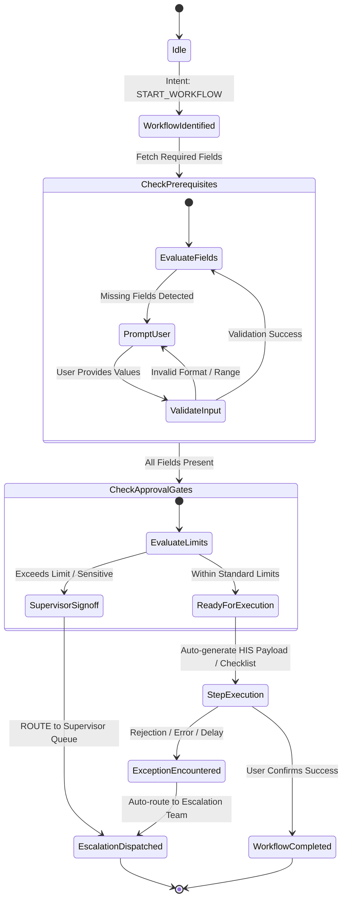

# 04. Guided Workflows & Routing Engine

## 1. The "Do It With Me" Guided Workflow Model

Hospital frontline staff do not just ask informational questions; they execute complex operational transactions under time pressure. If a chatbot simply drops a 20-page SOP PDF on a front-desk receptionist, operational friction increases.

The **Guided Workflow Engine** treats operational procedures as state-machine micro-flows driven by the Knowledge Graph:
1. **Identifies the Workflow**: Maps the user's intent to a specific `Workflow` node.
2. **Evaluates Missing Slots**: Determines which `Field` nodes are marked `is_required` and currently unfulfilled.
3. **Presents Progressive Input Fields**: Requests missing parameters 1 or 2 at a time (optimized for mobile screens).
4. **Validates Data Types**: Deterministically verifies dates, MRN formats, and insurer names against allowed vocabularies.
5. **Enforces Human-in-the-Loop Thresholds**: If an action involves an irreversible transaction (financial refund $> \$100$, account privilege escalation, medical record release), execution halts and routes for human supervisor sign-off.

---

## 2. Workflow State Machine Architecture



---

## 3. Field Definition & Validation Specification

```python
from pydantic import BaseModel, Field
from typing import Optional, List
from enum import Enum
import re

class FieldDataType(str, Enum):
    STRING = "string"
    INTEGER = "integer"
    DATE = "date"
    ENUM = "enum"
    CURRENCY = "currency"

class WorkflowField(BaseModel):
    field_id: str
    label: str
    data_type: FieldDataType
    is_required: bool = True
    is_sensitive: bool = False
    allowed_values: Optional[List[str]] = None
    validation_regex: Optional[str] = None

    def validate_value(self, value: Any) -> bool:
        if self.is_required and (value is None or str(value).strip() == ""):
            return False
        if self.allowed_values and value not in self.allowed_values:
            return False
        if self.validation_regex and not re.match(self.validation_regex, str(value)):
            return False
        return True
```

---

## 4. Golden Path Walkthrough: MRI Pre-Authorization

### Step 1: Initial Ingestion & Missing Slot Analysis
- **User Message**: *"Patient has an MRI scheduled tomorrow, insurer is Star Health, auth is pending. What should I do?"*
- **Role**: Front Office Executive.
- **Engine State**:
  - Matched Workflow: `WF-RAD-MRI-AUTH-01` (*Outpatient MRI Pre-Authorization*).
  - Required Fields: `Insurer` (Star Health - Captured), `Procedure Code` (MRI Brain/Spine - Missing), `Scheduled Date` (Tomorrow - Captured), `Portal Status` (Pending - Captured).
  - Outcome: `GUIDE`.
  - Assistant Output: *"For Star Health, outpatient MRI pre-authorization is mandatory under SOP-TPA-014. Please confirm the exact MRI procedure code or anatomical region (e.g., MRI Brain with Contrast)."*

### Step 2: Slot Fulfillment & Next Action
- **User Message**: *"Procedure is MRI Lumbar Spine without contrast."*
- **Engine State**:
  - All mandatory slots fulfilled.
  - Verified Status: `Portal Status = Pending`.
  - Next Action from Graph (`Step 4: Pending Status Protocol`):
    - Verify submission timestamp on TPA Portal.
    - If submitted $< 4$ hours ago: SLA window is active; monitor portal every 60 minutes.
    - If submitted $> 4$ hours ago: Escalate to Star Health Priority Desk (Phone: Ext 4022).

### Step 3: Rejection Branch & Escalation Handoff
- **User Message**: *"Portal status just changed to 'Rejected due to insufficient clinical justification'."*
- **Engine State**:
  - Trigger Condition: Rejection encountered.
  - Policy Rule: `Insurer Rejection` $\implies$ State `ROUTE` to `Insurance/TPA Desk`.
  - Action: Generate Escalation Ticket `#TKT-8492`.
  - Assistant Output: *"Pre-authorization was rejected by Star Health due to clinical documentation. I have created escalation ticket #TKT-8492 and routed it to the In-House TPA Desk with high priority. A pre-authorization executive has been notified to attach clinical notes."*

---

## 5. Support Routing Engine & Escalation Tickets

### 5.1 Deterministic Routing Matrix

| Trigger Category | Specific Condition | Target Department | Escalation Urgency | Max Response SLA |
| :--- | :--- | :--- | :--- | :--- |
| **Cashless Rejection** | TPA portal query / rejection | Insurance / TPA Desk | URGENT | 30 minutes |
| **Billing Dispute** | Adjustment $> \$200$ | Billing Supervisor | ROUTINE | 2 hours |
| **Discharge Hold** | Pharmacy / Lab clearance block | Nursing In-Charge | URGENT | 15 minutes |
| **HIS Account Provisioning** | Admin role or VIP chart access | IT / HIS Security Lead | ROUTINE | 4 hours |
| **Biomedical Fault** | Modality downtime (MRI / CT / Cath) | Biomedical Engineering | CRITICAL | 10 minutes |
| **Facility Emergency** | Fluid spill / electrical fault | Facility & Safety Desk | CRITICAL | 5 minutes |
| **Knowledge Insufficiency** | $S_{\text{total}} < 0.50$ (No approved SOP) | Department Operations Head | ROUTINE | 24 hours |

### 5.2 Dynamic Urgency Calculation
Urgency is deterministically evaluated using context attributes:
```python
def calculate_urgency(query: str, session: Session) -> str:
    high_urgency_triggers = [
        "patient waiting", "counter crowd", "surgery scheduled",
        "stat", "icu transfer", "discharge delayed", "code"
    ]
    if any(trigger in query.lower() for trigger in high_urgency_triggers):
        return "URGENT"
    if session.has_modality_downtime or session.has_clinical_rejection:
        return "URGENT"
    return "ROUTINE"
```

### 5.3 Escalation Ticket Payload
```json
{
  "ticket_id": "TKT-2026-8492",
  "created_at": "2026-10-08T13:20:00Z",
  "initiator": {
    "user_id": "EMP-4019",
    "role": "Front Office Executive",
    "counter": "Counter-03"
  },
  "assigned_team": "Insurance / TPA Desk",
  "urgency": "URGENT",
  "reason": "INSURER_REJECTION",
  "summary": "Star Health rejected pre-authorization for MRI Lumbar Spine due to missing clinical justification.",
  "tried_steps": [
    "Verified mandatory cashless admission documents under SOP-TPA-014",
    "Checked portal status (Status: REJECTED)",
    "Identified missing clinical progress notes"
  ],
  "evidence_cited": ["SOP-TPA-014", "FORM-TPA-REQ-02", "SYS-TPA-PORTAL"],
  "status": "OPEN",
  "audit_ref": "c5f6a8e0-47b2-4d1a-96e8-23fbc0432190"
}
```
