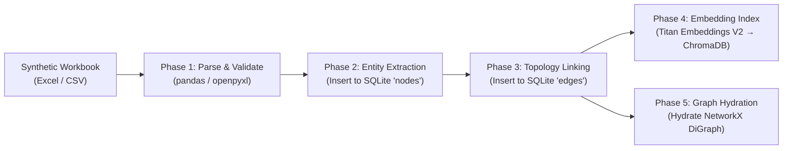

# 06. Data Ingestion & Workbook-to-Graph Mapping

## 1. Synthetic Workbook Architecture

The official problem statement specifies a synthetic workbook with 5 primary data sheets. The system transforms these tabular sources into an interconnected Knowledge Graph (Layer 2) and deterministic rule bindings (Layer 3).

### Sheet-to-Graph Mapping Matrix

| Workbook Sheet | Role in System | Graph Nodes Ingested | Graph Edges Generated |
| :--- | :--- | :--- | :--- |
| **Approved Knowledge Articles** | Layer 1 Core Truth | `Article` | `visible_to` → `Role`, `supersedes` → `Article`, `owned_by` → `Team` |
| **Workflow Information** | Layer 2 Procedures | `Workflow`, `Step` | `has_step`, `precedes`, `requires` → `Field`/`Form`, `done_in` → `System`, `owned_by` → `Team`, `escalates_to` → `Team`, `defined_in` → `Article` |
| **Routing Rules** | Layer 3 Decision Logic | Bindings on `Team` nodes | Deterministic lookup table: `(Issue Type, Conditions) → Target Team` |
| **Field Definitions** | Layer 2 Data Contracts | `Field` | `requires` (incoming from `Step`) |
| **Operations Requests** | Test & Validation Set | *Not ingested into graph* | Split into Few-shot seeds (30%) and Held-out Evaluation Set (70%) |

---

## 2. Expected Column Schemas Per Sheet

### 2.1 Sheet: `Approved Knowledge Articles`
Governing SOPs, policies, circulars, and departmental guidelines.

| Column | Type | Maps To | Required | Description |
| :--- | :--- | :--- | :---: | :--- |
| `article_id` | string | `nodes.id` | ✅ | Primary identifier (e.g., `SOP-TPA-014`) |
| `title` | string | `nodes.title` | ✅ | Title of the policy or SOP |
| `body` / `content` | text | `nodes.body` | ✅ | Full instructional text / procedure description |
| `department` | string | `nodes.department` | ✅ | Department owning this procedure (e.g., `Radiology`) |
| `status` | string | `nodes.status` | ✅ | Must be `approved`, `draft`, or `retired` |
| `version` | string | `nodes.version` | ✅ | Semantic version string (e.g., `v2.1`) |
| `effective_date` | date | `nodes.effective_date` | ✅ | ISO date (`YYYY-MM-DD`) when policy became active |
| `review_due_date` | date | `nodes.review_due_date` | ⬜ | Expiry date for accreditation recertification |
| `owner` | string | `nodes.owner` | ✅ | Signatory authority (e.g., `Medical Superintendent`) |
| `supersedes` | string | `edges.supersedes` | ⬜ | Predecessor `article_id` replaced by this version |
| `visible_to_roles` | string | `edges.visible_to` | ⬜ | Comma-separated list of authorized roles or `ALL` |

### 2.2 Sheet: `Workflow Information`
Executable sequences for operational transactions.

| Column | Type | Maps To | Required | Description |
| :--- | :--- | :--- | :---: | :--- |
| `workflow_id` | string | `nodes.id` (type=`Workflow`) | ✅ | Master ID (e.g., `WF-RAD-MRI-AUTH-01`) |
| `workflow_name` | string | `nodes.title` | ✅ | Human-readable workflow title |
| `step_number` | integer | `nodes.id` (type=`Step`) | ✅ | Step index; generates `Step` node ID `WF_ID_STEP_N` |
| `step_description`| text | `nodes.body` | ✅ | Exact operational instructions for this step |
| `required_fields` | string | `edges.requires` | ⬜ | Comma-separated list of required `field_id`s |
| `system_used` | string | `edges.done_in` | ⬜ | Software application used (e.g., `HIS`, `TPA Portal`) |
| `department` | string | `nodes.department` | ✅ | Department executing the workflow |
| `owner_team` | string | `edges.owned_by` | ✅ | Support team maintaining this workflow |
| `escalation_team` | string | `edges.escalates_to` | ⬜ | Fallback team if rejection or exception occurs |
| `governing_article`| string | `edges.defined_in` | ⬜ | Authorizing `article_id` for compliance grounding |

### 2.3 Sheet: `Routing Rules`
Deterministic mappings driving Layer 3 ticket creation and support handoffs.

| Column | Type | Maps To | Required | Description |
| :--- | :--- | :--- | :---: | :--- |
| `issue_type` | string | Rule Condition | ✅ | Category extracted during Step 2 (Understand) |
| `conditions` | string | Rule Predicate | ⬜ | Logical conditions (e.g., `amount > 200`, `rejection = true`) |
| `target_team` | string | `nodes.id` (type=`Team`) | ✅ | Destination support team for escalation ticket |
| `priority` | string | Ticket Priority | ✅ | `ROUTINE`, `URGENT`, or `CRITICAL` |
| `escalation_target`| string | Secondary Team | ⬜ | Next-tier escalation if SLA breached |

### 2.4 Sheet: `Field Definitions`
Schema dictionary used by the Guided Workflow State Machine.

| Column | Type | Maps To | Required | Description |
| :--- | :--- | :--- | :---: | :--- |
| `field_name` | string | `nodes.title` (type=`Field`) | ✅ | Canonical field identifier (e.g., `patient_mrn`) |
| `field_type` | string | `nodes.metadata.type` | ✅ | `string`, `integer`, `date`, `enum`, `currency` |
| `allowed_values` | string | `nodes.metadata.allowed_values`| ⬜ | Pipe-separated choices (e.g., `Star Health\|HDFC Ergo`) |
| `is_required` | boolean| `nodes.metadata.required` | ✅ | Whether field blocks step progression |
| `is_sensitive` | boolean| `nodes.metadata.sensitive` | ⬜ | True for PII, financial, or security tokens |

### 2.5 Sheet: `Operations Requests`
Held-out validation set for evaluation benchmarks and routing accuracy checks.

| Column | Type | Purpose | Required | Description |
| :--- | :--- | :--- | :---: | :--- |
| `request_text` | text | Evaluation Input | ✅ | Raw user message |
| `initiator_role` | string | Role Persona | ⬜ | Role of user asking the question |
| `correct_team` | string | Ground Truth Routing | ✅ | Expected target team for accuracy metric |
| `correct_outcome`| string | Ground Truth State | ⬜ | Expected state: `ANSWER`, `GUIDE`, `ROUTE`, `REFUSE` |

---

## 3. Ingestion Pipeline Implementation



### Phase 1: Parse & Validate
- Ingest Excel sheets via `pandas` or `openpyxl`.
- Normalize headers: lowercase, replace spaces with underscores, strip whitespace.
- Run schema validation check ensuring mandatory columns exist.

### Phase 2: Create Nodes Table Entries
```python
def ingest_articles(df_articles, db_cursor):
    for _, row in df_articles.iterrows():
        db_cursor.execute("""
            INSERT OR REPLACE INTO nodes 
            (id, type, title, body, department, status, version, effective_date, review_due_date, owner, metadata)
            VALUES (?, 'Article', ?, ?, ?, ?, ?, ?, ?, ?, ?)
        """, (
            row['article_id'],
            row['title'],
            row['body'],
            row.get('department', 'General'),
            row.get('status', 'approved').lower(),
            row.get('version', 'v1.0'),
            row.get('effective_date', '2026-01-01'),
            row.get('review_due_date', None),
            row.get('owner', 'Operations Committee'),
            json.dumps({"visible_to": row.get('visible_to_roles', 'ALL').split(',')})
        ))
```

### Phase 3: Create Edges Table Entries
- Connect `Workflow` to `Step` with `has_step`.
- Connect sequential `Step` nodes with `precedes` using `step_number` ordering.
- Connect `Step` to referenced `Field` and `Form` nodes with `requires`.
- Connect `Step` to referenced `System` with `done_in`.
- Connect `Workflow` to `Team` with `owned_by` and `escalates_to`.
- Connect `Article` to previous versions with `supersedes`.

### Phase 4: Vector Store Indexing
- Concatenate `title + " " + body` for all approved nodes.
- Generate dense vector embeddings via **Amazon Titan Text Embeddings V2** (`amazon.titan-embed-text-v2:0`).
- Upsert vectors into local **ChromaDB** collection with role and department metadata tags for pre-filtering.

### Phase 5: In-Memory Graph Hydration
- Read all records from `nodes` and `edges` into a `networkx.DiGraph`.
- Run health checks: verify zero broken foreign keys, detect cycles, check graph diameter.

---

## 4. Contingency Synthetic Data Generator

If the official hackathon workbook is not yet provided, our seed generator (`backend/app/data/seed_generator.py`) generates a fully compliant synthetic workbook containing:

1. **20 Approved Knowledge Articles**: Covering Front Office, Admission, Billing, Radiology (MRI prep, contrast consent), Pharmacy, HIM, IT access, and Biomedical waste.
2. **6 Complete Workflows**: Including the golden-path *Outpatient MRI Pre-Authorization*, *Discharge Billing Clearance*, *HIS Account Creation*, and *Specimen Rejection Handling*.
3. **15 Routing Rules**: Covering cashless rejections, billing disputes above limits, AC/infrastructure leaks, and modality downtimes.
4. **25 Field Definitions**: Type-validated attributes with strict allowed values and sensitivity tags.
5. **35 Operations Requests**: Realistically phrased employee inquiries paired with expected outcomes and teams.
